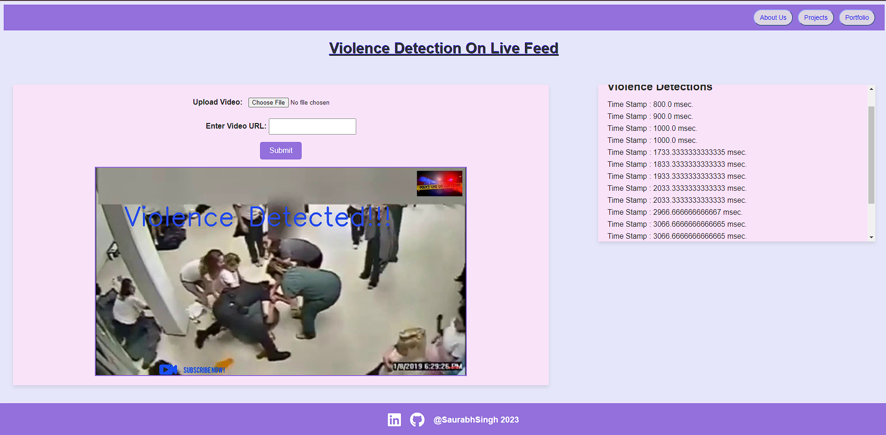
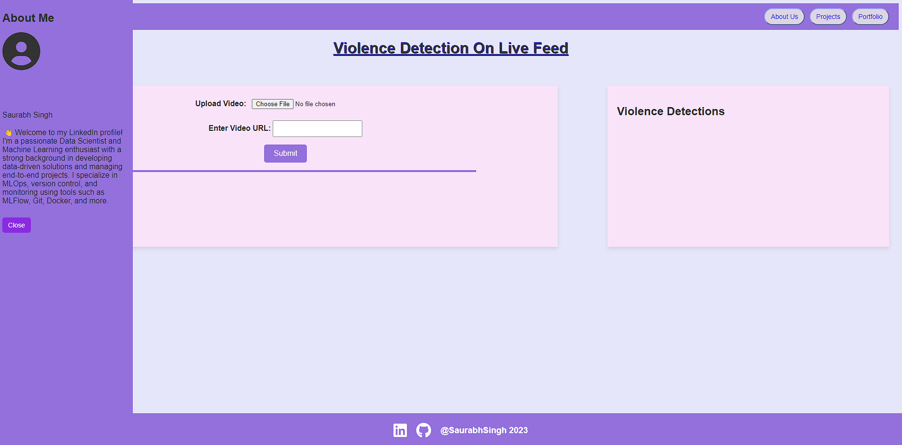

# Violence Detection using Live Video Feed

## Project Overview

### Introduction
Violence detection using live video feed is a machine learning project designed to enhance public safety by automatically identifying and alerting authorities to potentially violent situations in real-time. This project leverages machine learning algorithms, computer vision, and live video analysis to detect instances of violence and aggression.

### Project Purpose
The primary goal of this project is to contribute to the improvement of public safety and security. In crowded places, public events, or surveillance scenarios, the ability to quickly identify and respond to violent incidents is crucial. By automating the detection process through machine learning, we aim to provide a tool that can assist security personnel, law enforcement, and emergency responders in responding promptly to potential threats.

### Project Image

## Tech Stacks

### 1. TensorFlow
TensorFlow is a powerful open-source machine learning framework that is extensively used for building and training machine learning models. In this project, TensorFlow is employed for creating and training the violence detection model.

### 2. Python
Python serves as the primary programming language for the project. It is widely used in the field of machine learning and provides a vast ecosystem of libraries and tools. Python is utilized for implementing the machine learning algorithms, handling video feeds, and creating the web application.

### 3. Flask
Flask is a lightweight web application framework in Python. It is used to develop the backend of the application, which handles communication between the machine learning model and the frontend user interface.

### 4. HTML, CSS, and JS
HTML, CSS, and JavaScript are used to build the frontend of the web application. The user interface allows users to interact with the system, view live video feeds, and receive alerts when violent behavior is detected.

### 5. OpenCV (Open Source Computer Vision Library)
OpenCV is a widely-used computer vision library that provides tools for image and video analysis. In this project, OpenCV is employed to process live video feeds, extract relevant features, and pass the frames to the machine learning model for violence detection.

### Project Workflow

1. **Video Input**: Live video feeds are captured from cameras placed in the monitored area.

2. **Video Processing with OpenCV**: OpenCV processes each frame of the video feed, extracting features and preparing the data for analysis.

3. **Machine Learning Model**: The pre-trained TensorFlow machine learning model analyzes the processed frames to detect instances of violence or aggression.

4. **Alert System**: If violence is detected, an alert is triggered, and relevant authorities are notified in real-time.

5. **User Interface**: The Flask-based web application provides users with a visual interface to monitor live video feeds, receive alerts, and access historical data.

## Why This Project is Needed for Society

1. **Public Safety**: The project enhances public safety by automating the detection of violent incidents, allowing for quicker response times and improved situational awareness.

2. **Security Optimization**: Provides a proactive security solution for public places, events, and surveillance scenarios, reducing the risk of violence and potential harm to individuals.

3. **Resource Efficiency**: Automating violence detection with machine learning reduces the reliance on manual monitoring, allowing security personnel to focus on critical tasks.

4. **Crime Prevention**: By identifying and addressing potential threats in real-time, the project contributes to the prevention of crimes and disturbances.

5. **Quick Response to Emergencies**: Enables faster response to emergencies by providing immediate alerts to law enforcement and emergency responders.

This project aims to leverage advanced technologies to create a safer and more secure environment for society. By combining machine learning, computer vision, and web technologies, it addresses the pressing need for effective violence detection in public spaces.

